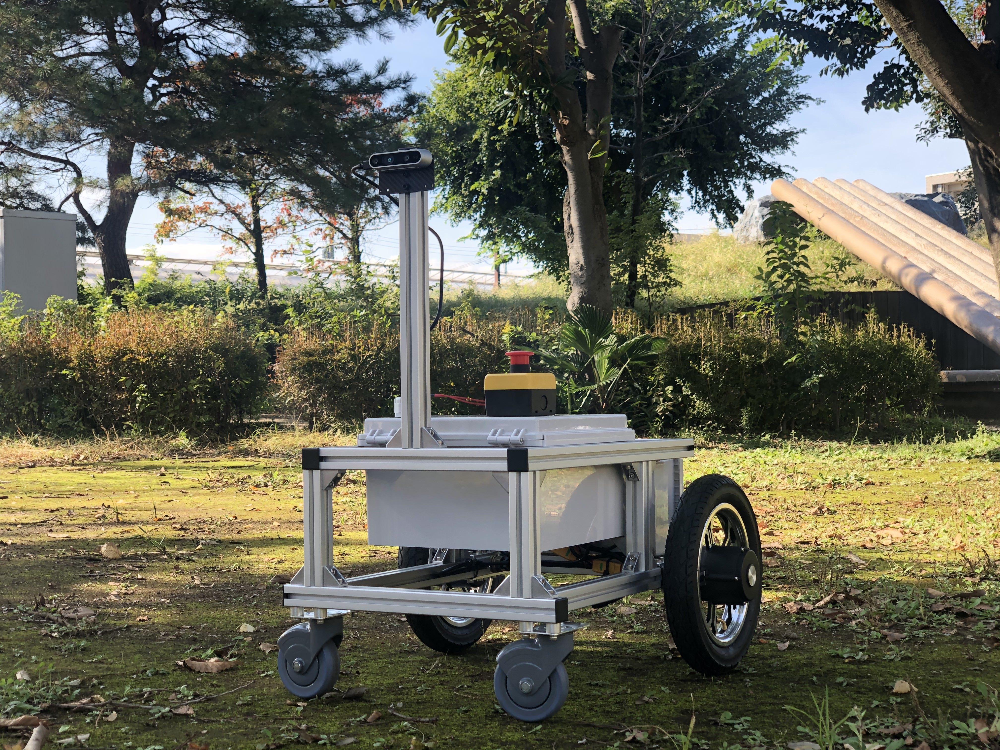
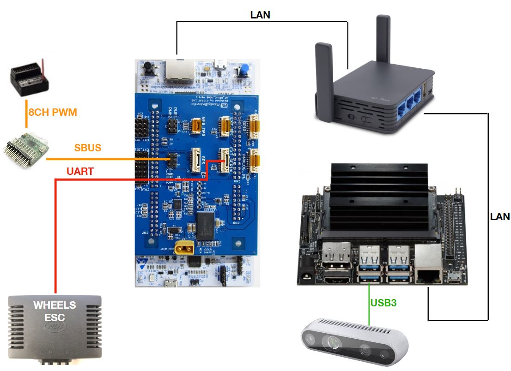
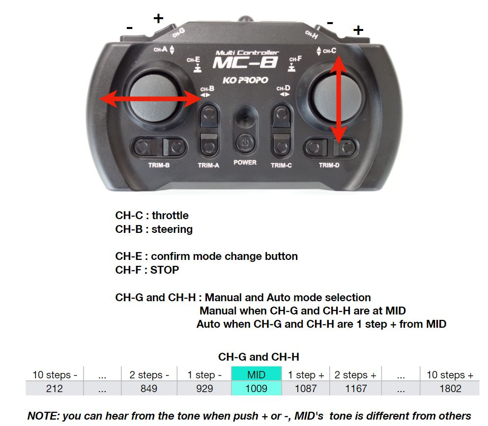
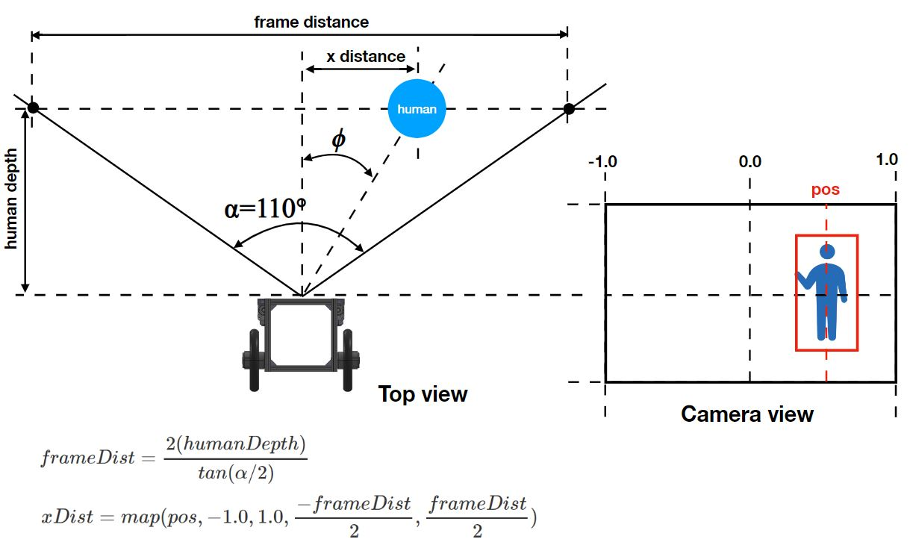
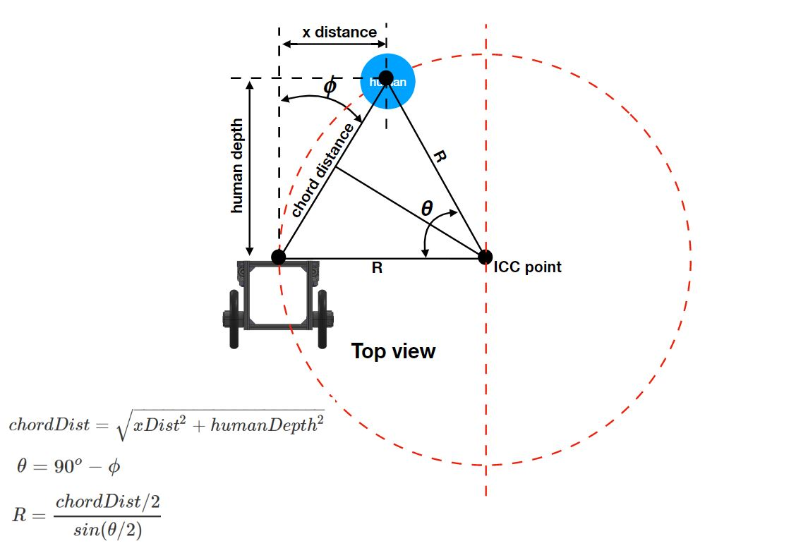
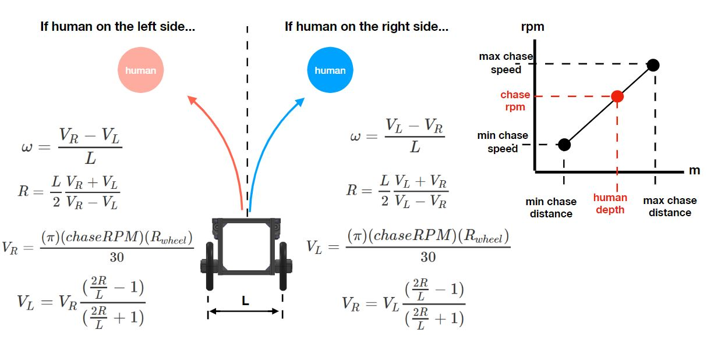

# ATCart

This is a first version of ATCart for follow mode UGV robot. This robot can detect human and follow the closest human.

Note that this repo is only the autopilot scripts, to make it runs, you need a human detection part from this [repo](https://github.com/mfassler/collision-detector.git) and also the mbed c++ code.

# Set up
The required hardware and connection are shown in the image below

This robot is controlled manually by KO propo (Futaba optional). Control channels are assigned as in the image.

You can check out this [video](https://www.youtube.com/watch?v=wR2KNPnT8nE&t=6s) on how to change the mode and manually control on ATCart with KO Propo.

# Human Following Algorithm
The idea behind this is quite simple if we know how far the robot to the target human, which we can use the IntelRealsense for this purpose. The camera has a Field of View angle around 110degress approximately. We know the depth of camera to human then we can calculate the frame distance. The collision-detector code will provide you the human value in pixel, then we can map that value with the frame distance to get how far a human from the center frame in meter.

After both human depth and x distance are known, we can calculate the chord distance from right angle trinometry formular. Then the ICC Radius can be calculated from those chord distance and angle.

So if we know ICC R and robot parameters like wheels radius and L, we can arrange the kinematics equations as follow.

If there is human on the right side, you can see that VR would be smaller than VL, so we can set VL as the function of the speed (rpm) and chasing distance (m) as linear. So VR can be calculated from the last equation. Similarly when human is on the left side, VR would be decided from linear graph and VL would be calculated from the last equation.

# Real Test
If you have all the hardware turn on properly, you can start make the robot follow human. First, you need to access to Jetson Nano via `ssh nvidia@192.168.8.230` on your pc terminal (your pc must be on the same LAN on GLiNet wifi router). Then going to the collision-detector directory `cd collision-detector`, them hit `./alertIfTooClose 127.0.0.1`, you will see the Intel Realsense driver running and following by the darknet, if you not see any error so everything goes fine!
Open new terminal and access via ssh again. Go to `SagaProject` directory by hit `cd SagaProject`. Run `python3 main.py`, if there is no error, you will send some message running on the terminal screen like "MANUAL MODE" or something. You can go change a chasing speed, skidding speed, chasing range, skidding range on FollowBot.py script. Don't forget to change the mode to automode on your KO Propo, make sure the MOAB board LED turn to blue. You are now having the HUMAN-FOLLOWING robot like me in this [video](https://www.youtube.com/watch?v=En8BYIk1vSY).

# Trouble Shooting
I found there is a problem if you don't plug the LAN cable to the MOAB, so if you want to run only manual mode, DON'T FORGET to plug the LAN cable otherwise you will not able to control the whole robot even in manual mode. So this project is designed to run in both mode, so I suggest to have fully devices plugging on properly.

After you plug the battery cable, the Jetson Nano sometime doesn't turn on, due to the in rush current of starting so just unplug the black power jack on Jetson Nano only to turn on again.

The WIFI router takes like a minute to turn on from start, so it's basically slow at first time, but after everything on fire, you are ready to go!
